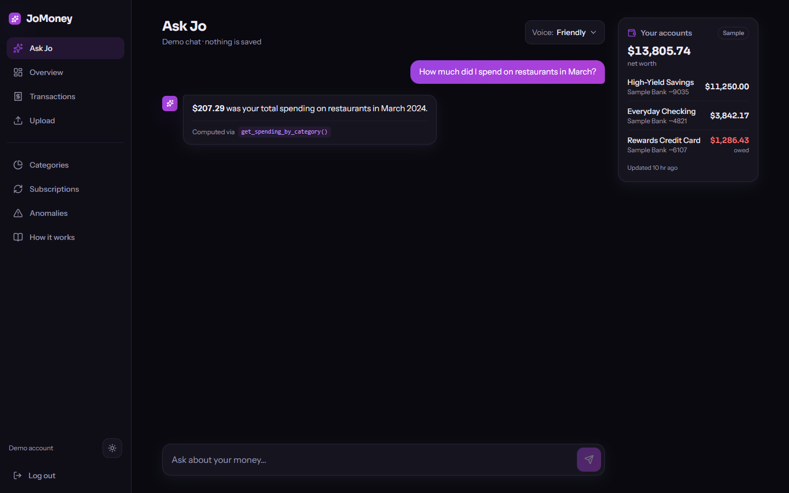
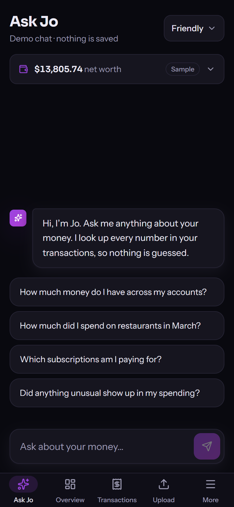
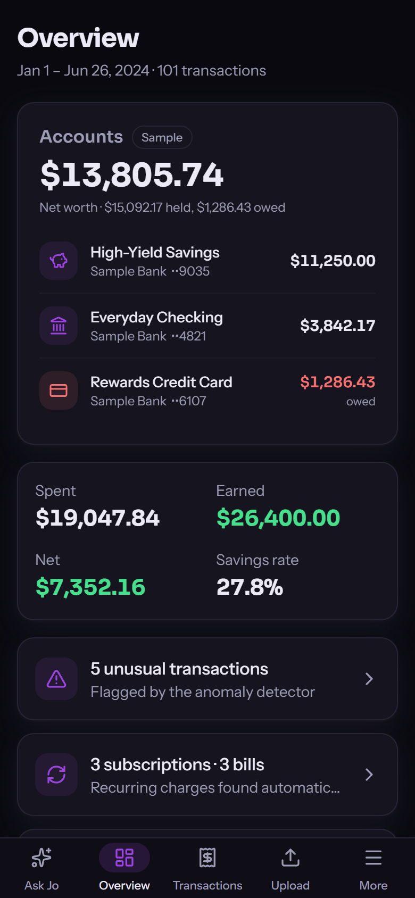
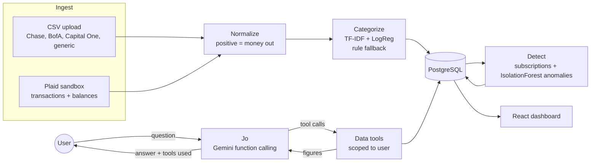
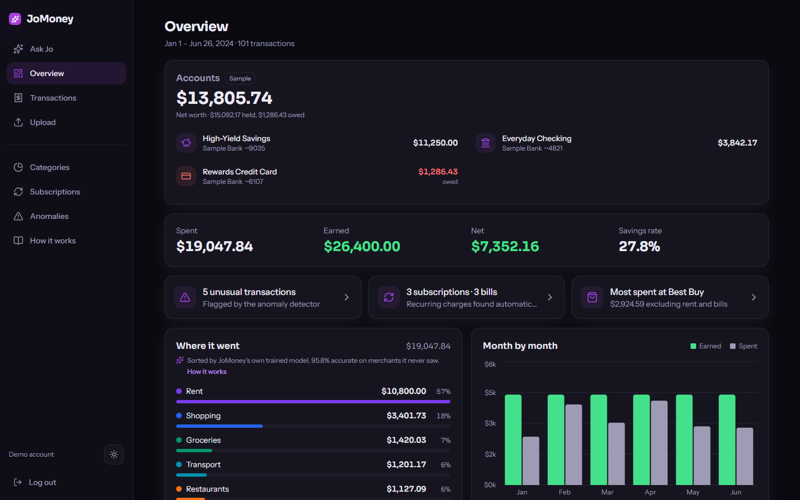
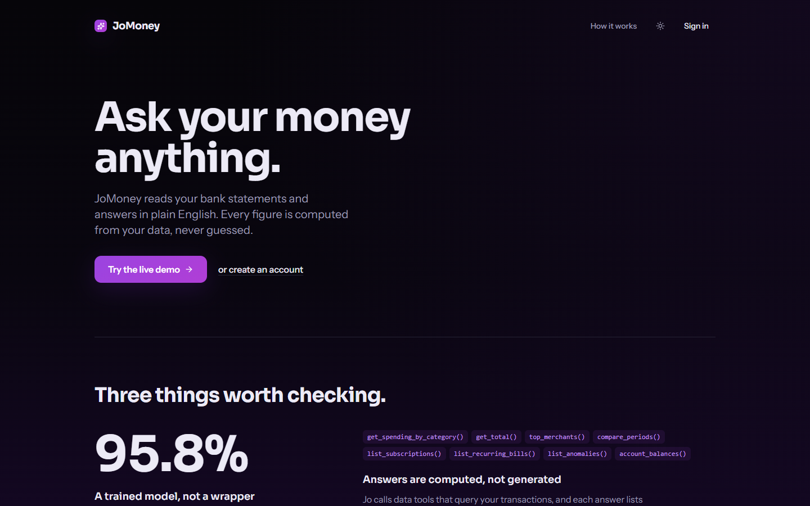
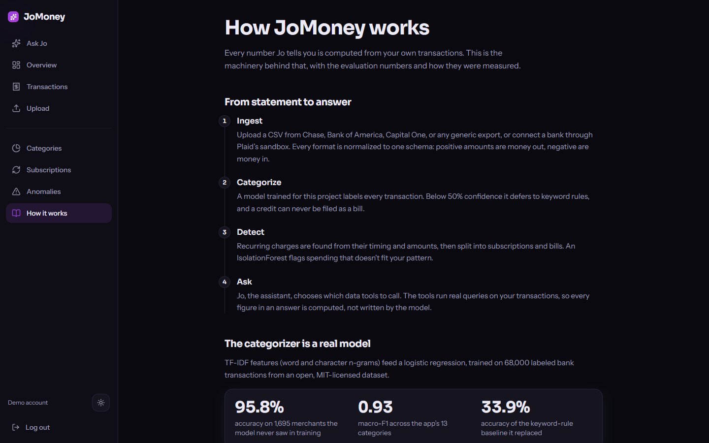

# JoMoney

**Ask your money anything.** JoMoney reads your bank statements, categorizes every transaction with a model trained for this project, finds subscriptions and unusual charges, and lets you ask **Jo**, a conversational assistant, questions in plain English. Every figure Jo gives is computed from your data by real queries, never written by the language model.

**Live demo: [askjomoney.site](https://askjomoney.site)** (one tap, no signup, synthetic sample data)

[](https://github.com/shurjo05/FinancialAIAssistant/actions/workflows/ci.yml)
[](https://github.com/shurjo05/FinancialAIAssistant/actions/workflows/ml-eval.yml)

<p>
  
</p>

<p>
  
  
</p>

---

## Three things worth checking

### 1. The categorizer is a trained model, not an API call
A TF-IDF (word + character n-grams) → logistic regression model, trained on 68,000 labeled bank transactions ([`DoDataThings/us-bank-transaction-categories-v2`](https://huggingface.co/datasets/DoDataThings/us-bank-transaction-categories-v2), MIT).

| Metric (merchant-disjoint test set) | Value |
|---|---|
| Accuracy on 1,695 merchants never seen in training | **95.8%** |
| Macro-F1 across the app's 13 categories | **0.93** |
| Keyword-rule baseline it replaced | 33.9% |

- **No leakage:** the test split is grouped by merchant, so no merchant in the test set appears in training. A naive random split inflated the score by letting the model memorize merchant names. ([Engineering note 2](docs/ENGINEERING_NOTES.md#2-inflated-accuracy-from-traintest-merchant-overlap-data-leakage))
- **Known weak spot, stated:** income recall is 0.46 because a paycheck and a transfer can read alike. At inference, the transaction's direction settles it: money coming in is never filed as a bill.
- **Hybrid inference:** below 50% confidence it defers to keyword rules. User corrections are stored with the model version that made the prediction, as training signal for a gated retrain.
- **Regression gate:** a separate CI workflow re-scores the pinned model on the same split and fails if macro-F1 drops more than 0.03 below the recorded baseline.

Code: [`app/ml/train.py`](backend/app/ml/train.py), [`app/ml/eval_categorizer.py`](backend/app/ml/eval_categorizer.py), [`app/ml/model_metadata.json`](backend/app/ml/model_metadata.json), [`app/services/categorizer.py`](backend/app/services/categorizer.py).

### 2. Answers are computed, not generated
Jo runs on Gemini with automatic function calling. The model chooses which tool to call; the tool runs a query scoped to the signed-in user and returns the number. Each answer lists the tools it used.

```
get_spending_by_category()   get_total()             top_merchants()     compare_periods()
list_subscriptions()         list_recurring_bills()  list_anomalies()    account_balances()
```

- **Memory:** saved conversations with a bounded, token-trimmed context window. Jo re-calls tools for fresh numbers instead of trusting earlier text.
- **Failure behavior:** with no API key, a deterministic engine calls the same tools, so the app works offline. With a key, any AI failure becomes a retryable error with a Retry button, never a context-free guess.
- **Cost control:** a model fallback chain spreads load across free-tier quotas, plus a daily cap that only counts successful calls.
- **Guardrails:** Jo stays on the user's finances and treats merchant text as data, not instructions.

Code: [`app/services/ai_service.py`](backend/app/services/ai_service.py), [`app/services/gemini_provider.py`](backend/app/services/gemini_provider.py), [`app/services/tools.py`](backend/app/services/tools.py).

### 3. It's built like production software
| Area | What's there |
|---|---|
| Accounts | JWT auth with bcrypt, revocable tokens ("log out all devices"), per-user data isolation with cross-user tests |
| Data | PostgreSQL in production, SQLite locally; schema managed by Alembic, with model/migration drift checked in CI |
| Delivery | GitHub Actions: ruff + pytest on SQLite **and** Postgres, migrations, frontend lint + build, Docker build, pip/npm audit. Deployed as one Docker service on Render |
| Bank data | Plaid **sandbox** connect flow; access tokens Fernet-encrypted at rest; balances and net worth |
| Abuse | Cloudflare Turnstile + disposable-email blocking on signup, per-IP and per-user rate limits, destructive actions refused on the shared demo account |
| Operations | JSON logs with request IDs (no payloads), DB-aware health check, in-memory metrics for fallback rate and latency |

---

## How it works



- **Subscriptions:** a merchant charged at least three times at a steady interval, for a consistent amount, is recurring. Rent and utilities are classed as bills, streaming and gyms as subscriptions.
- **Anomalies:** an IsolationForest with guardrails (income, transfers and rent are skipped; only unusually high spending is flagged). On a small **synthetic** benchmark with injected anomalies it caught 5 of 5 with no false alarms. That is a controlled test, not a claim about real-world accuracy.

The same explanation, with the evaluation details, is in the app at [askjomoney.site/how-it-works](https://askjomoney.site/how-it-works).

<details>
<summary><strong>More screens</strong></summary>

**Overview:** balances, totals, findings that link to their detail pages, and spending ranked by category.


**Landing page**


**How it works**

</details>

---

## Tech stack
- **Backend:** Python 3.11, FastAPI, SQLAlchemy 2.0, Alembic, PostgreSQL / SQLite, scikit-learn, pandas, Gemini (`google-genai`), Plaid, slowapi, pytest, ruff
- **Frontend:** React, TypeScript, Vite, Tailwind CSS, TanStack Query, Recharts, React Router, oxlint
- **Infrastructure:** Docker (multi-stage, one service serving API + SPA), Render, Neon Postgres, GitHub Actions, Cloudflare

---

## Run it locally
Needs Python 3.11 and Node 22. **No API keys are required.** Without them Jo uses its offline engine, and Plaid and CAPTCHA stay hidden.

```bash
# Backend (from the repo root)
python -m venv .venv
.venv/Scripts/activate            # macOS/Linux: source .venv/bin/activate
cd backend
pip install -r requirements.txt
python -m scripts.fetch_model     # pinned categorizer from GitHub Releases (skip it and keyword rules take over)
alembic upgrade head
python -m uvicorn app.main:app --port 8000
```

```bash
# Frontend (second terminal)
cd frontend
npm install
npm run dev                       # http://localhost:5173 (proxies /api to :8000)
```

Open http://localhost:5173 and choose **Try the live demo**, or create an account and upload one of the sample CSVs in [`data/`](data/).

**Optional environment variables** (`backend/.env`, see [`.env.example`](backend/.env.example)):

| Variable | Enables |
|---|---|
| `GOOGLE_API_KEY` | Gemini for Jo (otherwise the offline engine answers) |
| `GOOGLE_MODEL`, `GOOGLE_FALLBACK_MODELS`, `GEMINI_DAILY_CAP` | Model choice, fallback chain, daily call cap |
| `PLAID_CLIENT_ID`, `PLAID_SECRET`, `PLAID_ENCRYPTION_KEY` | "Connect a bank" in Plaid's sandbox (sign in with `user_good` / `pass_good`) |
| `TURNSTILE_SECRET` + frontend `VITE_TURNSTILE_SITE_KEY` | CAPTCHA on signup |
| `DATABASE_URL` | PostgreSQL instead of the local SQLite file |
| `JWT_SECRET` | Token signing (required in production) |

**Tests and evaluation:**
```bash
cd backend
pytest                              # 131 tests, external services mocked
ruff check .
python -m app.ml.eval_categorizer   # re-score the pinned model (downloads the 68k-row dataset once)
python -m app.ml.eval_anomaly       # synthetic anomaly benchmark
```

---

## Design decisions
- **Grounding over generation.** The language model routes; the database answers. That trades some conversational flexibility for figures that are always traceable.
- **Retry over a wrong fallback.** Once Jo had memory, answering a follow-up with the context-free offline engine would often be wrong, so a failure asks for a retry instead.
- **Our model over Plaid's labels.** Plaid transactions go through the same categorizer as CSVs: one taxonomy, and a test of the model on a new source.
- **A modular monolith.** One FastAPI service and one Postgres database. No queues, microservices or vector database, because nothing at this scale needs them.
- **Graceful degradation everywhere.** Every integration is feature-flagged, so the whole app still runs with zero keys.

The full decision log, including the bugs and how they were found, is in [`docs/ENGINEERING_NOTES.md`](docs/ENGINEERING_NOTES.md). Security choices and deferred items are in [`docs/SECURITY.md`](docs/SECURITY.md).

---

## Limitations
- The demo runs on **synthetic** data, and bank connections use Plaid's **sandbox** (test institutions only).
- Gemini's free tier is small (a handful of requests per minute per model). The fallback chain and daily cap soften this, but heavy use hits limits.
- The shared demo account still accepts uploads, which every visitor then sees.
- Merchant names arrive in capitals, so display title-casing can't tell acronyms apart ("Spotify Usa").

## Roadmap
- **Investments (read-only):** holdings, allocation, fees and benchmark-relative returns through Plaid Investments, with grounded Jo tools. No trading and no buy/sell advice.
- Block uploads and bank connections on the shared demo account.
